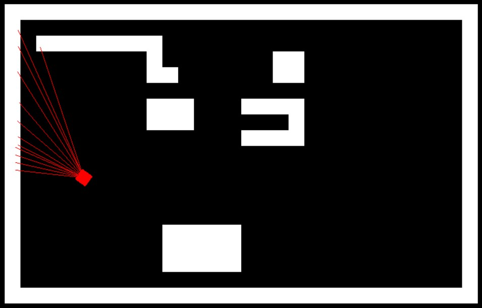
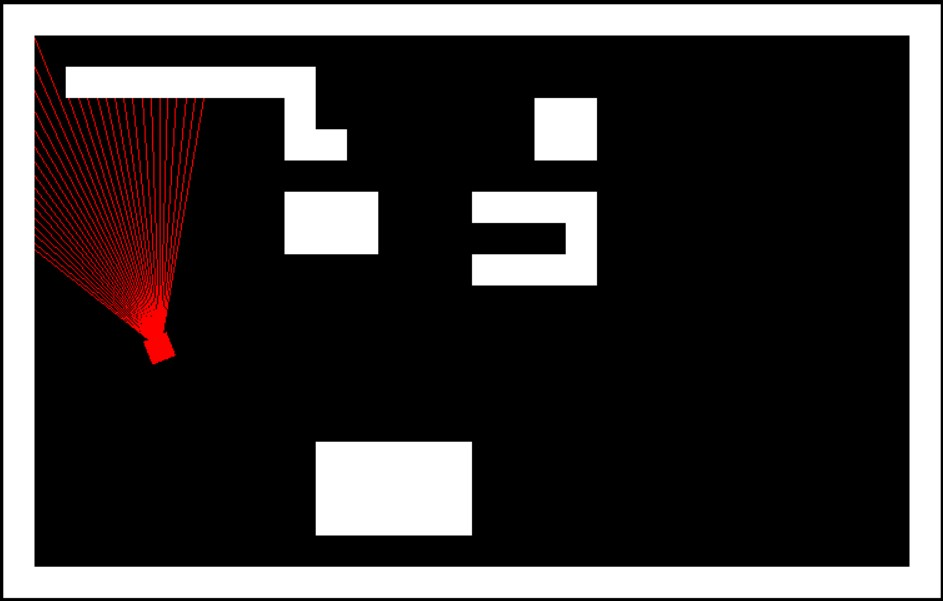
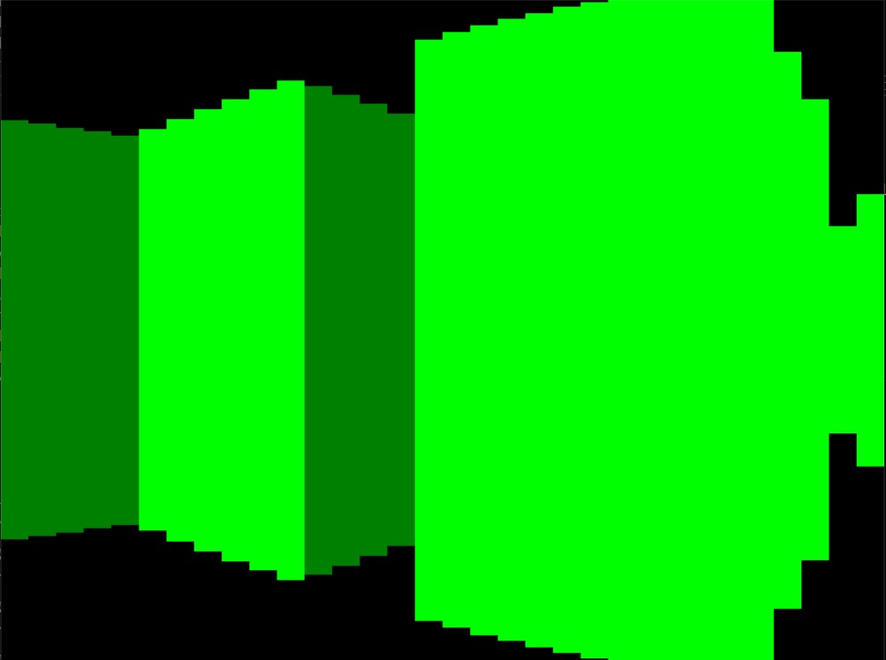
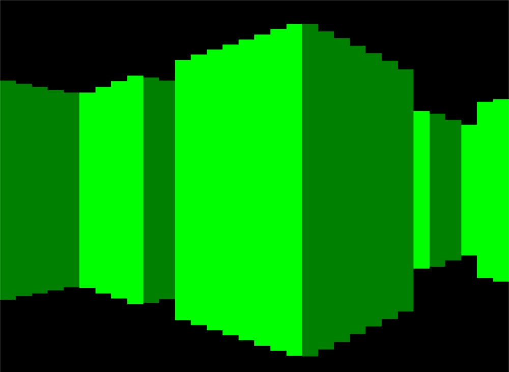

# RayCasting Engine [](https://github.com/Mattli8312/RayCaster/blob/main/LICENSE)  

## OverView

This is a RayCasting "Engine" implemented in python using various python modules. The GUI was implemented in pygame, a common python library used for rendering 2D images/frames in the terminal. This project was inspired by my interests in computer graphics and learning technqiues for rendering 3D terrains. This Engine is a simple implementation of a ray caster which will render a 2D maze-like structure in 3D. In this README, I will provide all details including documentation, development, applications, installation, optimizations, and contributions. This program is still in development and needs a lot more work, but this is the baseline of the RayCasting Engine which you can play around with :).

## Installation

In order to run this application, you will need to install pygame and the most recent version of python, specifically python 3 and above.

Simply Clone this repository to a folder in your local system:

```
$ cd FolderName
$ git clone https://github.com/Mattli8312/RayCaster.git
```

Then, If you don't have pygame installed, install pygame via pip:

```
$ python3 -m pip install -U pygame --user
```

Visit this link if you have further questions for more detailed explanations: https://www.pygame.org/wiki/GettingStarted

## Development Process

### Rendering the Map

Rendering the map was a very simple process. I wrote the map in txt files, and had a method to read the file and render rectangles in the window screen at certain locations in the Map.py file.

### Rendering the Camera

This part was a little trickier, given that I have only rotated sprites and not shaped surfaces. I had to consult stackoverflow to help me rotate the camera on a 2D surface while enabling other camera features such as moving the camera forward and backward.

https://stackoverflow.com/questions/36510795/rotating-a-rectangle-not-image-in-pygame/51381391#51381391

### Rendering the Center Ray and peripheral rays

This was the meat of the project and I had two implementations. The first naive implementation involved starting from the center of the camera and slowly drawing out intervals of the ray at a specific angle until that ray has intersected a wall. There were three main issues with this approach however:

* The intersection points on the walls were inconsistent, meaning that some rays travelled too far into the barriers, creating ray distortions.
* The computational cost of this method was too much. Even after tuning certain parameters, The framerate could not handle this amount of computation. As a result it was very slow and not feasible for a standard machine.
* Because Some rays would "overshoot" the bound, the rounding errors would cause some rays to "Merge" with other rays decreasing the quality of the image significantly.



The second implementation was much better and counteracted the previous issues. This result was inspired by 3DSage, a youtuber who makes a RayCasting engine from scratch. This method was much faster and after tuning some parameters in the main.py file, I got it running fairly smoothely.



### Rendering the 3D Surface

Naive Approach: Simply take the distance calculated for each ray and take the inverse. This creates a parallax effect such that for objects further away, they will seem smaller. Each ray generated per frame is responsible for generating a segment of a wall. You can increase the quality of the frame by increasing the number of rays generated for the camera, however you will need to decrease the spacing between the rays to avoid warping the image. 



Although this may seem fine at first, there is a main issue with this: The image appears warped. To avoid this "fisheye" effect, we needed to multiply the distance by the cosine of the angle between the ray and the central camera ray. You can see the effects of this afterwards:



## Contributing

As of right now, there are no known bugs in the code, however, if you happen to come across some issues, or want add additional features
to the application, feel free to make pull requests.